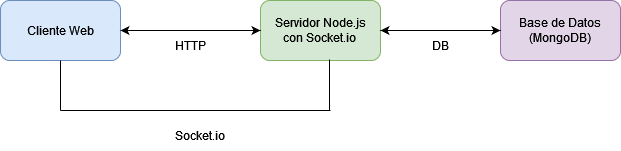
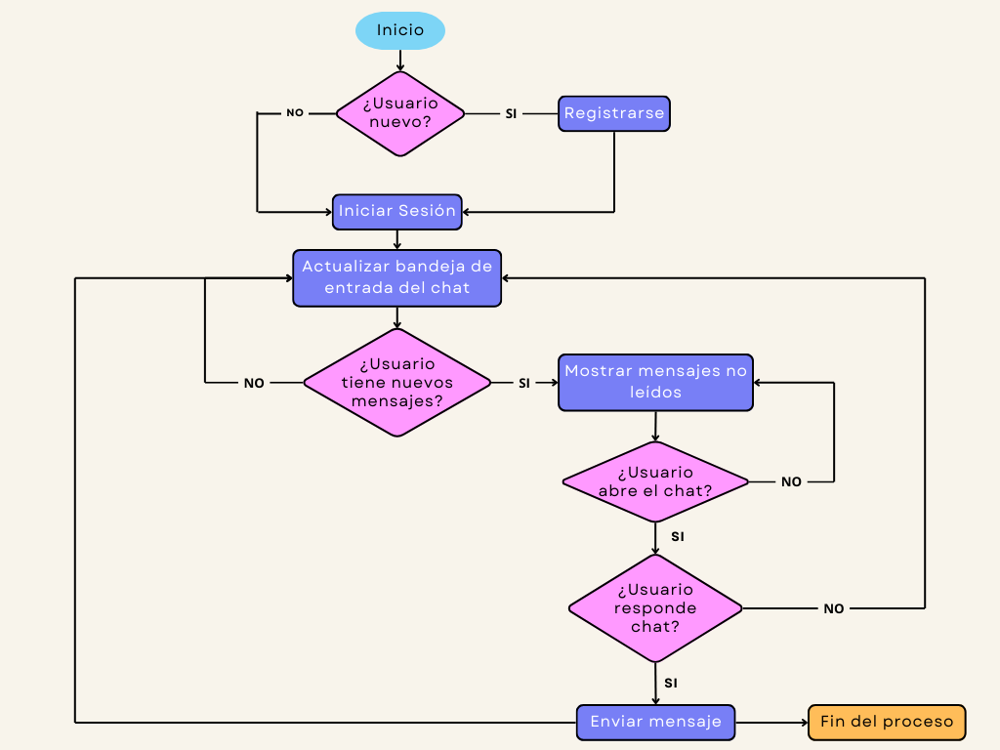
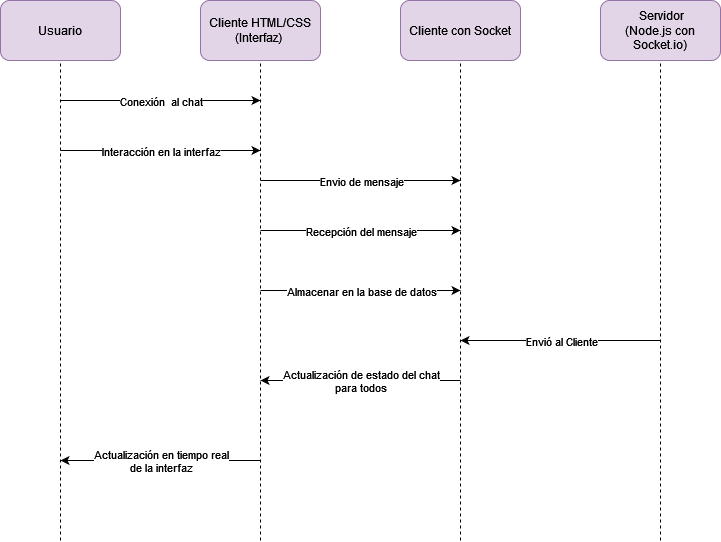
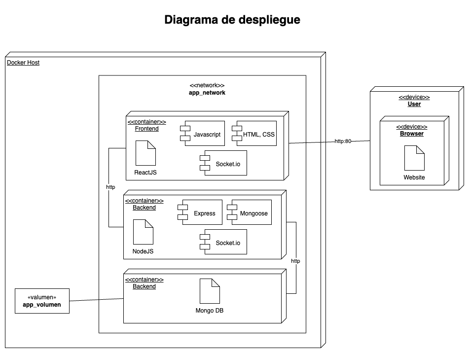
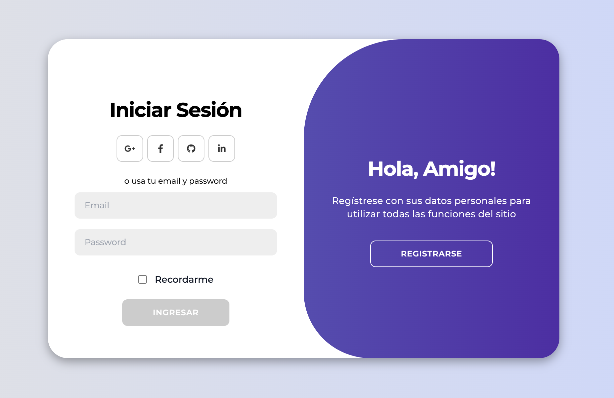
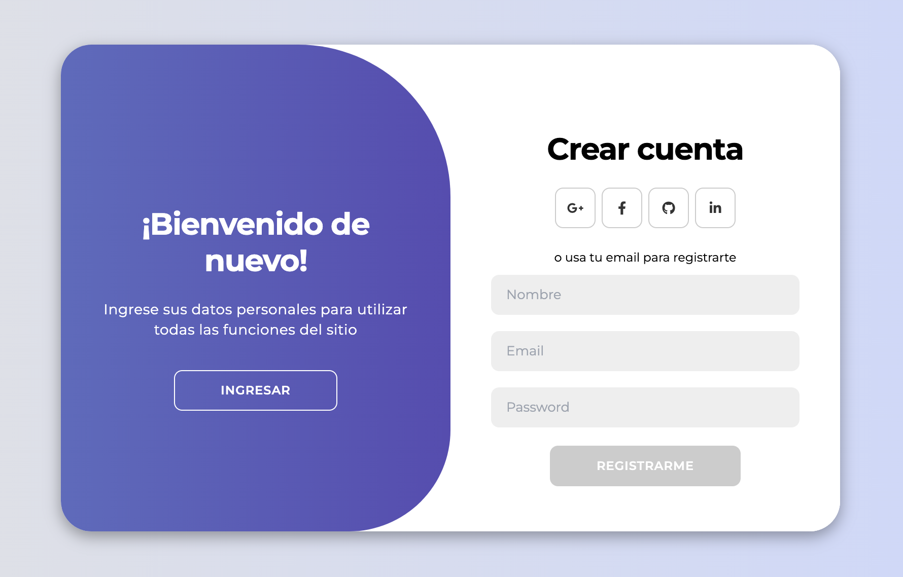
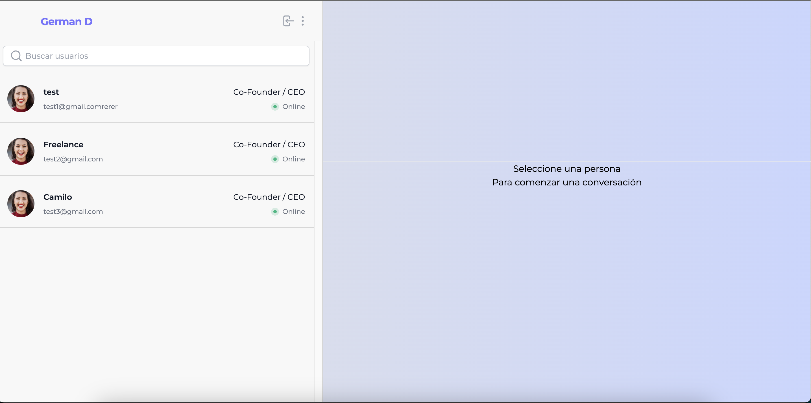
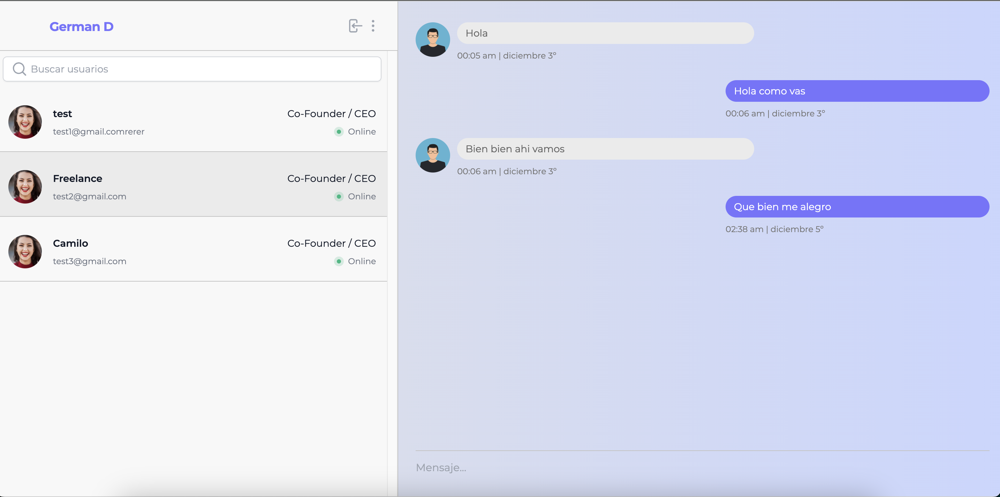
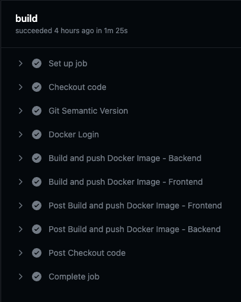

<!-- Recursos Utilizados 
 
    - BADGES => https://shields.io/badges 
    - EMOJIS => https://github.com/ikatyang/emoji-cheat-sheet/blob/master/README.md 
    - DOCUMENTAR => https://docs.github.com/es/get-started/writing-on-github/getting-started-with-writing-and-formatting-on-github/basic-writing-and-formatting-syntax 

  El trabajo debe incluir:

  - Identificar las herramientas y tecnologías necesarias para la implementación de DevOps en el proyecto.
  - Crear un plan de implementación de DevOps, teniendo en cuenta las necesidades y características del proyecto.
  - Configurar y poner en marcha las herramientas y tecnologías seleccionadas, siguiendo el plan de implementación.
  - Integrar las diferentes fases del ciclo de vida del software (desarrollo, pruebas, implementación y operaciones) en un proceso unificado de entrega de software.
  - Automatizar el proceso de entrega de software, utilizando herramientas y tecnologías de automatización de pruebas, compilación, integración y despliegue.
  - Al final de la tarea, se debe presentar un informe detallado de la implementación de DevOps en el proyecto, incluyendo los resultados obtenidos, los desafíos encontrados y las lecciones aprendidas.
  - Toda la documentación debe encontrarse en un repositorio público realizado para tal fin, con el tipo de tipo de licencia de uso libre. 
  
  Métricas de calificación.
  Artefactos de un proyecto de software DevOps incluyen 
   - arquitectura, 
   - código fuente, 
   - scripts de configuración, 
   - imágenes de contenedor, 
   - scripts de prueba, 
   - documentación, 
   - artefactos de compilación y contenedores. Estos artefactos se usan para crear, probar, implementar y administrar aplicaciones de software.

-->

  <a href="https://github.com/GermanBejarano/ChatProject">
    <!--   -->
     
  </a>
  <h2 align="center">Proyecto Chat
</h2>

  
  
  

- - - 

##### *Asignatura*: Diplomado de seguridad en devOps
##### *Carrera*: Ingenieria de Sistemas

- - -

  

## Índice

- [Índice](#índice)
- [Descripción](#descripción)
- [Objetivos](#objetivos)
- [Stakeholders](#stakeholders)
- [Alcance](#alcance)
    - [Registro de usuarios y autenticación](#registro-de-usuarios-y-autenticación)
    - [Restricciones y Limitaciones](#restricciones-y-limitaciones)
    - [Entregables Esperados](#entregables-esperados)
- [Requerimientos](#requerimientos)
  - [Funcionales](#funcionales)
    - [Código del requerimiento:](#código-del-requerimiento)
    - [Nombre del requerimiento:](#nombre-del-requerimiento)
    - [Descripción del requerimiento:](#descripción-del-requerimiento)
    - [Datos de entrada:](#datos-de-entrada)
    - [Datos de salida:](#datos-de-salida)
  - [Requerimientos Funcionales](#requerimientos-funcionales)
  - [Requerimientos No Funcionales](#requerimientos-no-funcionales)
- [Diagramas](#diagramas)
  - [Diagrama de Arquitectura](#diagrama-de-arquitectura)
  - [Diagrama de Flujo](#diagrama-de-flujo)
  - [Diagrama de Secuencia](#diagrama-de-secuencia)
  - [Diagrama de despliegue](#diagrama-de-despliegue)
  - [Historias de Usuario](#historias-de-usuario)
- [Arquitectura del Sistema](#arquitectura-del-sistema)
  - [Backend](#backend)
  - [Frontend](#frontend)
- [Requisitos](#requisitos)
- [Configuración del entorno y ejecución](#configuración-del-entorno-y-ejecución)
- [Uso del sistema](#uso-del-sistema)
- [Docker](#docker)
- [CI/CD](#cicd)

## Descripción

El proyecto "Sistema de Chat en Tiempo Real" tiene como objetivo proporcionar una plataforma de mensajería instantánea que permita a los usuarios conectarse y comunicarse en tiempo real. El sistema utilizará tecnologías como Node.js, Socket.io, MongoDB, Reactjs, Tailwind CSS entre otras, para ofrecer una experiencia de usuario fluida y eficiente, esto con el fin de mantener comunicados a las personas que utilicen este chat tomándolo como una herramienta corporativa, que pueda desvincular cualquier servicio de mensajería de uso personal y su comunicación sea a través de esta herramienta.

Este proyecto se basa en el marco de trabajo agil Scrum, donde se prioriza la funcionalidad elemental para darle un producto rapido al cliente que lo pueda utilizar con efectividad y testear y a posteriori dar su feedback.

Este proyecto se desarrollara en dos etapas, la primera tendra una duracion de 3 meses, la cual se dividira en 4 sprints de 3 semanas cada uno, en los cuales se ejecutara lo siguiente:

- **Sprint 1**: Levantamiento de informacion, descripcion del proyecto, objetivos, se inicia el alcance.
- **Sprint 2**: Se termina el alcance, se empieza a definir requerimientos funcionales y no funcionales, tambien se empieza a trabajar los diferentes diagramas.
- **Sprint 3**: Se termina los puntos anteriores y se empieza a desarrollar el backend y el frontend en base a lo descrito anteriormente.
- **Sprint 4**: Se finaliza el desarrollo y se conteneriza las imagenes y se implementa el CI/CD.

Como se menciona anteriormente para entregar un producto rapidamente en esta primera etapa solo se desarrollara la parte de inicio de sesion, el registro del usuario y como tal el chat en tiempo real.

Para la segunta etapa se implementara, funciones tales como: modificación del perfil del usuario, mejora de interfaz del chat, agregar opcion de cargue y envio de archivos, notificaciones y mejora del registro del usuario para mejorar la personalizacion.

## Objetivos

-  Diseñar una plataforma de chat en tiempo real, que permita a los usuarios conectarse forma rápida y sin complicaciones.
-  Ofrecer una interfaz de usuario intuitiva y atractiva, desarrollada con reactjs, que garantice una experiencia de usuario positiva.
-  Facilitar la comunicación instantánea entre usuarios a través de la implementación de Socket.io para la transmisión de mensajes en tiempo real.
-  Almacenar de manera segura y eficiente los mensajes y datos de usuario en una base de datos MongoDb para garantizar la continuidad de las conversaciones.
-  Implementar medidas de seguridad robustas para proteger la integridad de los datos y garantizar la privacidad de los usuarios.

**Beneficios Esperados:**

`Comunicación Eficiente:`
- Mejorar la eficiencia de la comunicación entre usuarios, permitiendo interacciones más rápidas y directas.

`Experiencia de Usuario Mejorada:`
- Proporcionar una interfaz de usuario atractiva y fácil de usar, mejorando la satisfacción del usuario.

`Colaboración en Tiempo Real:`
- Facilitar la colaboración en proyectos y grupos al proporcionar una plataforma de chat en tiempo real.
 
`Adaptabilidad:`
- Brindar una plataforma adaptable que pueda integrarse con futuras tecnologías y requisitos.

### Matriz de Stakeholders

- Desarrollador: Responsable de la implementación y mejora continua del sistema.
- Propietarios del software: Responsable de disponer los recursos para el desarrollo del sistema.
- Usuarios Finales: Aquellos que utilizarán el sistema para la comunicación en tiempo real.

  <a href="https://github.com/GermanBejarano/ChatProject">
    <!--   -->
     
     
     
  </a>
 

  
## Alcance

Con el avance exponencial de la tecnología, constantemente nacen nuevas herramientas que facilitan la comunicación. De ahí, se fortalece la idea de crear un chat en tiempo real, esto con el fin de optimizar el tiempo y  facilitar los medios de comunicación. Chat en tiempo real, es una herramienta de tipo empresarial, que pretende establecer una comunicación eficaz y oportuna. Hoy por hoy, uno de los aspectos más importante a tener en cuenta es el Tiempo, con chat en tiempo real, se da una solución exitosa, que permitirá el aprovechamiento del tiempo de una forma más efectiva. Chat en tiempo real, es un software que permite el registro, autenticación de usuarios, envío y recepción de mensajes en tiempo real. La aplicación estará disponible 7 días a la semana durante 12 horas diurnas, contará con una interfaz sencilla y de fácil manejo, de igual forma será compatible con navegadores chrome y firefox, El sistema utilizará tecnologías como Node.js, Socket.io, MongoDB, Reactjs, Tailwind CSS entre otras, al ser una aplicación contenerizada presentan un nivel de seguridad alto, ya que puede ejecutarse como procesos aislados y pueden funcionar de forma independiente de otros contenedores.

en este desarrollo se abordarán los siguientes aspectos:

### Registro de usuarios y autenticación

- Interfaz de usuario atractiva y fácil de usar.
- Autenticación de cada usuario con credenciales para mayor seguridad y confidencialidad de los datos.
- Funcionalidades de chat en tiempo real utilizando Socket.io.
-	Almacenamiento persistente de mensajes en una base de datos mongo DB.
-	Implementación de medidas de seguridad para proteger la privacidad y la integridad de los datos.

### Restricciones y Limitaciones

- El proyecto se desarrollará en un tiempo estimado de 6 meses, influyendo la fase de diseño, análisis, desarrollo y pruebas.
- Los recursos, tanto humanos como tecnológicos, estarán limitados según los requisitos del proyecto.

### Entregables Esperados

-	Código fuente del sistema.
-	Documentación completa del código y del sistema.
-	Guías de implementación y operación.
-	Interfaz de usuario funcional y atractiva.
-	Sistema desplegado y en funcionamiento.
-	Manuales de usuario.

## Requerimientos

### Funcionales

Este proyecto consiste en el desarrollo de un aplicativo (chat) que permita el envió de datos en tiempo real, siempre y cuando se de correctamente el proceso de validación de los usuarios. 

Descripción de los requerimientos funcionales y no funcionales.

Formato de la tabla de especificación de los requerimientos:

|  Código del requerimiento     |       |
| ----------------------------- | ----- |
| Nombre del requerimiento      |       | 
| Descripción del requerimiento |       | 
| Datos de entrada              |       | 
| Resultados                    |       |  
| Prioridad                     |       |  

#### Código del requerimiento:

Cada requerimiento debe tener una identificación, el nombre puede ser alfanumérico y se requiere que inicie con las letras en mayúscula RF o RNF que hace referencia a requerimientos funcionales y no funcionales. Seguidos de un número, ejemplo 01 o 1.

#### Nombre del requerimiento: 

Se da con el fin de identificar el requerimiento de forma resumida, por el nombre se da a entender a que hace referencia.

#### Descripción del requerimiento: 

Sspecifica directamente que se quiere lograr con este requerimiento, es una breve explicación de su funcionalidad.

#### Datos de entrada: 

Se explica que tipos de datos se requiere para el buen uso del sistema.

#### Datos de salida: 

Hace referencia al resultado que se obtiene al ingresar los datos y poner en funcionamiento el sistema.
Prioridad: describe su nivel de importancia. Alta, media  o baja.

### Requerimientos Funcionales

| Código del requerimiento      | RF-01                                                                                |
| ----------------------------- | -------------------------------------------------------------------------------------|
| Nombre del requerimiento      | Registro de usuarios                                                                 | 
| Descripción del requerimiento | El usuario deberá diligenciar un formulario, el cual contiene datos personales como: |
|                               | nombre, correo electrónico, teléfono, contraseña (este dato debe ser escrito 2 veces,|
|                               | para su comprobación), cuando ya se haya diligenciado el formulario se envia y se    |
|                               | realizan validaciones en el servidor de base de datos donde se confirma que el       |
|                               | usuario no existe y que los datos son válidos, de esta forma se puede registrar.     |
|                               | Del mismo modo, se generan notificaciones en caso de que algún dato sea erroneo.     |
| Datos de entrada              | nombre, correo electrónico, teléfono, contraseña                                     | 
| Resultados                    | Registro de usuario exitoso                                                          | 
| Prioridad                     | Alta                                                                                 | 

| Código del requerimiento      | RF-02                                                                                |
| ----------------------------- | -------------------------------------------------------------------------------------|
| Nombre del requerimiento      | Modificación de usuario                                                              | 
| Descripción del requerimiento | El usuario podrá modificar los datos registrados con anterioridad, siempre y cuando  |
|                               | se validen los datos en la base de datos, se deben ingresar datos como datos         |
|                               | personales como: nombre, correo electrónico, teléfono, contraseña (este dato debe    |
|                               | ser escrito 2 veces, para su comprobación).                                          |
| Datos de entrada              | nombre, correo electrónico, teléfono, contraseña                                     | 
| Resultados                    | Usuario modificado exitosamente                                                      | 
| Prioridad                     | Alta                                                                                 | 

| Código del requerimiento      | RF-03                                                                                |
| ----------------------------- | -------------------------------------------------------------------------------------|
| Nombre del requerimiento      | Ingreso de usuarios                                                                  | 
| Descripción del requerimiento | Los usuarios ya registrados y autenticados podrán ingresar a la interfaz de usuarios |
|                               | resgistrados y autenticados.                                                         |
| Datos de entrada              | datos de usuarios                                                                    | 
| Resultados                    | Se mostrará la interfaz de usuarios registrados                                      | 
| Prioridad                     | Alta                                                                                 |

| Código del requerimiento      | RF-04                                                                                |
| ----------------------------- | -------------------------------------------------------------------------------------|
| Nombre del requerimiento      | Ingreso automático de usuarios                                                       | 
| Descripción del requerimiento | Los usuarios ya registrados y autenticados podrán guardar sus datos, para que el     |  
|                               | siguiente inicio de sesión lo pueda hacer de forma automatica solo registrando la    |
|                               | opción guardar datos de inicio.                                                      |
| Datos de entrada              | usuario, contraseña                                                                  | 
| Resultados                    | Se ingresa automaticamente                                                           | 
| Prioridad                     | Alta                                                                                 |

| Código del requerimiento      | RF-05                                                                                |
| ----------------------------- | -------------------------------------------------------------------------------------|
| Nombre del requerimiento      | Selección de usuarios                                                                | 
| Descripción del requerimiento | Los usuarios ya registrados y autenticados podrán verificar los datos de los otros   |
|                               | usuarios, seleccionarlos para poder enviar un mensaje.                               |
| Datos de entrada              | selección de usuarios                                                                | 
| Resultados                    | Dirige el usuario a la interfaz de envio de mensajes                                 | 
| Prioridad                     | Alta                                                                                 | 

| Código del requerimiento      | RF-06                                                                                |
| ----------------------------- | -------------------------------------------------------------------------------------|
| Nombre del requerimiento      | Enviar mensajes                                                                      | 
| Descripción del requerimiento | Los usuarios ya registrados y autenticados podrán escribir y enviar mensajes de      |
|                               | texto, los cuales pueden incluir letras, números y símbolos.                         |
| Datos de entrada              | números, letras, simbolos                                                            | 
| Resultados                    | El mensaje se enviará al usuario seleccionado                                        | 
| Prioridad                     | Alta                                                                                 |

| Código del requerimiento      | RF-07                                                                                |
| ----------------------------- | -------------------------------------------------------------------------------------|
| Nombre del requerimiento      | Recibir mensajes                                                                     | 
| Descripción del requerimiento | Los usuarios ya registrados y autenticados podrán recibir los mensajes enviados por  |
|                               | otros usuarios registrados y autenticados.                                           |
| Datos de entrada              | N/A                                                                                  | 
| Resultados                    | visualiza los mensajes que ha recibido                                               | 
| Prioridad                     | Alta                                                                                 | 

| Código del requerimiento      | RF-08                                                                                |
| ----------------------------- | -------------------------------------------------------------------------------------|
| Nombre del requerimiento      | Cierre de sesión                                                                     | 
| Descripción del requerimiento | Los usuarios ya registrados y autenticados podrán cerrar la sesión cuando ya no      |
|                               | hagan uso del chat.                                                                  |
| Datos de entrada              | N/A                                                                                  | 
| Resultados                    | cerró sesión exitosamente                                                            | 
| Prioridad                     | Alta                                                                                 | 

### Requerimientos No Funcionales

| Código del requerimiento      | RNF-01                                                                               |
| ----------------------------- | -----                                                                                |
| Nombre del requerimiento      | Validar estado de los usuarios                                                       | 
| Descripción del requerimiento | El sistema permite visualizar el estado actual de los usuarios (activo o inactivo).  |
| Resultados                    | Visualización de usuarios activos o inactivos                                        | 
| Prioridad                     | Alta                                                                                 | 

| Código del requerimiento      | RNF-02                                                                               |
| ----------------------------- | -------------------------------------------------------------------------------------|
| Nombre del requerimiento      | Cantidad de texto permitido                                                          | 
| Descripción del requerimiento | El sistema permite limitar la cantidad de texto que los usuarios ingresen en cada msj|
| Datos de entrada              | letras, números, caracteres                                                          | 
| Resultados                    | Notificación de limite de caracteres                                                 | 
| Prioridad                     | Alta                                                                                 |

| Código del requerimiento      | RNF-03                                                                               |
| ----------------------------- | -------------------------------------------------------------------------------------|
| Nombre del requerimiento      | Generar alertas (pendiente)                                                          | 
| Descripción del requerimiento | El sistema permite generar alertas o notificación según el uso del mismo,            |
|                               | restricciones o limitaciones de uso.                                                 |
| Resultados                    | Notificación de uso o solicitud de datos correctos.                                  | 
| Prioridad                     | Alta                                                                                 |

| Código del requerimiento      | RNF-04                                                                               |
| ----------------------------- | -------------------------------------------------------------------------------------|
| Nombre del requerimiento      | Disponibilidad 12/5                                                                  | 
| Descripción del requerimiento | El sistema estará disponible 12/5, Permite en ingreso en horario laboral de lunes a  |
|                               | viernes durante 12 horas diurnas.                                                    |
| Resultados                    | Permitir el ingreso en el horario designado                                          | 
| Prioridad                     | Alta                                                                                 |

| Código del requerimiento      | RNF-05                                                                               |
| ----------------------------- | -------------------------------------------------------------------------------------|
| Nombre del requerimiento      | Interfaz amigable                                                                    | 
| Descripción del requerimiento | El diseño de la interfaz es amigable, esto con el fin de que los usuarios puedan     |
|                               | tener contacto con ella de una forma rápida y sencilla.                              |
| Resultados                    | Interfaz de fácil uso                                                                | 
| Prioridad                     | Media                                                                                |

| Código del requerimiento      | RNF-06                                                                               |
| ----------------------------- | -------------------------------------------------------------------------------------|
| Nombre del requerimiento      | Compatibilidad (Chrome, firefox)                                                     | 
| Descripción del requerimiento | El sistema sera compatible con los navegadores chrome y firefox, por ende los        |
|                               | usuarios deben ingresar inicialmente a cualquiera de estos navegadores para hacer    |
|                               | uso del mismo e inciar su proceso de registro.                                       |
| Resultados                    | Despliegue en los navegadores Chrome y firefox                                       | 
| Prioridad                     | Alta                                                                                 |

| Código del requerimiento      | RNF-07                                                                               |
| ----------------------------- | -------------------------------------------------------------------------------------|
| Nombre del requerimiento      | Manual de usuario                                                                    | 
| Descripción del requerimiento | Estarán disponibles los manueales de usuario, con el fin de hacer un correcto uso del|
|                               | sistema.                                                                             |
| Resultados                    | Visualización de los manuales de usuario.                                            | 
| Prioridad                     | Alta                                                                                 |

| Código del requerimiento      | RNF-08                                                                               |
| ----------------------------- | -------------------------------------------------------------------------------------|
| Nombre del requerimiento      | Manual técnico                                                                       | 
| Descripción del requerimiento | Estarán disponibles los manueales de técnico, con el fin de hacer un correcto uso del|
|                               | sistema.                                                                             |
| Resultados                    | Visualización de los manuales de Técnicos.                                           | 
| Prioridad                     | Alta                                                                                 |

## Diagramas

A continuación se presentan algunos diagramas pertinentes para entender mejor la arquitectura y la logica del proyecto.

### Diagrama de Arquitectura
Este diagrama muestra la estructura general del sistema, incluyendo los componentes principales y cómo se comunican entre sí.

El Cliente Web se conecta al Servidor Node.js a través de HTTP para la carga inicial de la página.
Una vez cargada la página, se establece una conexión bidireccional persistente a través de Socket.io para permitir la comunicación en tiempo real entre el cliente y el servidor.
El Servidor Node.js gestiona la lógica del chat y comunica los mensajes entre los clientes conectados.
La Base de Datos almacena la información del chat, como mensajes y usuarios.

 

### Diagrama de Flujo

Este diagrama muestra el flujo de acciones y eventos en el sistema, desde la carga inicial de la página hasta el intercambio de mensajes en tiempo real.

El Cliente Web carga la página, establece una conexión WebSocket con el Servidor Node.js a través de Socket.io.
Cuando un usuario envía un mensaje, el cliente lo envía al servidor.
El Servidor Node.js recibe el mensaje y lo retransmite a todos los clientes conectados.
La Base de Datos puede ser consultada para almacenar o recuperar mensajes.

 

                            
### Diagrama de Secuencia

Muestra la interacción entre los diferentes componentes del sistema en secuencia temporal, desde el envío de un mensaje por parte del cliente hasta su almacenamiento en la base de datos y la transmisión a otros clientes.

 

<pre>
<code>

+----------------------+        +---------------------+        +---------------------+       +----------------------+
|        Usuario       |        | Cliente HTML/CSS   |        |   Cliente con        |       |       Servidor       |
|                      |        | (Interfaz)          |        |      Socket         |       | (Node.js con Socket.io)|
+----------------------+        +---------------------+        +---------------------+       +----------------------+
         |                               |                                |                                |
         |                               |                                |                                |
         |                               |                                |                                |
         |                               |                                |                                |
         +-------- "Conexión al Chat" ---->|                              |                                |
         |                               |                                |                                |
         |                               |                                |                                |
         |                               |                                |                                |
         +-------- "Interacción en la    |                                |                                |
         |           Interfaz"           |                                |                                |
         |                               |                                |                                |
         |                               |                                |                                |
         |                               +--- "Envío de Mensaje" -------> |                                |
         |                               |                                |                                |
         |                               |                                |                                |
         |                               +--- "Recepción de Mensaje" ---->|                                |
         |                               |                                |                                |
         |                               |                                |                                |
         |                               +--- "Almacenar en Base de Datos"----->|                          |
         |                               |                                |                                |
         |                               |                                |                                |
         |                               |                                |                                |
         |                               |                                |                                |
         |                               |                                |                                |
         |                               |                                |                                |
         |                               |                                |                                |
         |                               |                                |                                |
         |                               |                                |                                |
         |                               |                                |                                |
         |                               |                                |                                |
         |                               |                                |                                |
         |                               |                                |                                |
         |                               |                                |                                |
         |                               |                                |                                |
         |                               |                                |                                |
         |                               |                                |                                |
         |                               |                                |                                |
         +----- "Actualización en Tiempo |                                |                                |
                |  Real de la Interfaz"  |                                |                                |
                |                        |                                |                                |
                +<--- "Actualización de  |                                |                                |
                                         |  la Interfaz para Todos"       |                                |
                                         |                                |                                |
                                         +<--- "Actualización de Estado   |                                |
                                         |   del Chat para Todos"         |                                |
                                         |                                |                                |
                                         +-------------------------------->|                               |
                                         |                                |                                |
                                         |                                +<--- "Envío a Cliente" ---------|
                                         |                                |                                |
                                         |                                +<--- "Envío a Cliente" ---------|
                                         |                                |                                |
                                         |                                +<--- "Envío a Cliente" ---------|
                                         |                                |                                |
                                         |                                +<--- "Envío a Cliente" ---------|
                                         |                                |                                |
                                         +<--- "Fin del Proceso" ---------|                                |
                          

</code>
</pre>

### Diagrama de despliegue

Este diagrama muestra cómo los diferentes componentes de software y hardware de la aplicación se distribuyen y se despliegan en el entorno de ejecución. Este tipo de diagrama proporciona una vista de alto nivel de cómo interactúan los diferentes elementos de la aplicación del chat en el nivel de implementación.

 

### Historias de Usuario

| ID DE HISTORIA DE USUARIO                         | Como  <tipo de usuario>     | Quiero  <realizar alguna tarea>                                                               | para que pueda  <el logro algún objetivo>                              |
| ------------------------------------------------- | --------------------------- | --------------------------------------------------------------------------------------------- | ---------------------------------------------------------------------- |
| 1: Registro de Usuario                            | usuario nuevo               | poder registrarme en el sistema                                                               | acceso al chat y participar en conversaciones.                         |
| 2: Autenticación de Usuario                       | usuario registrado          | iniciar sesión con mis credenciales                                                           | acceder al sistema y utilizar las funciones de chat.                   |
| 3: Crear una Nueva Conversación                   |  usuario conectado al chat  | poder iniciar una nueva conversación                                                          | comunicarme con otros usuarios sobre un tema específico.               |
| 4: Enviar Mensajes en Tiempo Real                 | usuario en una conversación | enviar mensajes en tiempo real                                                                | comunicarme de manera instantánea con otros participantes.             |
| 5: Ver Mensajes Antiguos                          | usuario en una conversación | poder ver mensajes antiguos                                                                   | ponerme al día con la conversación y no perder información relevante   |
| 6: Almacenar Conversaciones Antiguas              |  usuario del sistema        | que las conversaciones antiguas se almacenen de forma persistente                             | poder acceder y revisar conversaciones anteriores en cualquier momento |
| 7: Personalizar Perfil                            | usuario registrado          | personalizar mi perfil con una foto y una descripción                                         | que otros usuarios puedan conocerme mejor.                             |
|  8: Notificaciones de Mensajes Nuevos             | usuario en el sistema       | recibir notificaciones cuando haya mensajes nuevos en las conversaciones en las que participo | mantenerme actualizado y no perder información importante.             |
| 9: Seguridad de la Conversación                   | usuario del sistema         | que mis conversaciones sean seguras y privadas                                                | garantizar la confidencialidad de la información intercambiada.        |
| 10: Eliminar Mensajes                             | usuario en una conversación | poder eliminar mensajes enviados                                                              | Para corregir errores o retirar información sensible.                  |
| 11: Integración de Emoticones y Archivos Adjuntos | usuario en una conversación | poder enviar emoticones y archivos adjuntos                                                   | enriquecer mis mensajes y expresar mejor mis ideas.                    |
| 12: Historial de Actividad del Usuario            | Como usuario del sistema    | Quiero poder revisar mi historial de actividad, incluyendo mensajes enviados y recibidos      | Para recordar conversaciones y seguir mi participación.                |

## Arquitectura del Sistema

### Backend

El backend está construido con Node.js y utiliza MongoDB para almacenar los mensajes y la información del usuario. Se utiliza Socket.io para la comunicación en tiempo real.

Estructura de carpetas del backend:
<pre>
<code>
  /chat_backend
    /controllers
    /database
    /helpers
    /middlewares
    /models
    /public
    /router
    index.js
    package.json
    .env
</code>
</pre>

### Frontend

El frontend está construido con React.js y utiliza Socket.io-client para la comunicación en tiempo real.

Estructura de carpetas del frontend:

<pre>
<code>
  /chat_frontend
    /public
    /src
      /auth
      /components
      /context
        /chat
      /css
      /helpers
      /hooks
      /pages
      /router
      /types
      ChatApp.js
    package.json
    .env
</code>
</pre>

## Requisitos

> [!IMPORTANT]
> Para que ejecute la aplicacion sin problema hay que tener en cuenta las versiones de los lenguajes y frameworks utilizados

- ***npm:*** v9.2.0
- ***Node js:*** v16.19.0 o superior
- ***React js:*** v17.0.1
- ***Mongo DB***
- ***Docker***

## Configuración del entorno y ejecución

Si se quiere probar el proyecto o realizar modificaciones antes de ejecutar la imagen del contenedor con docker o por el simple hecho de probar que todo esta funcionando correctamente de manera local se debe seguir los siguientes pasos para su debida configuracion y ejecucion:

1. Clonar el repositorio de gitHub, para esto se puede utilizar varios medios HTTPS, SSH, descargando el proyecto en .ZIP entre otros.
2. Una vez se tenga el proyecto de manera local se tendra dos directorios principales el ***chat_backend*** y el ***chat_frontend***, antes de empezar con la configuracion asegurese de cumplir con los requisitos del punto anterior.
   
   1. `Base de datos`: Como primera instancia se debe crear o tener acceso a un servicio de base de datos Mongo, se sugiere el servicio de Mongo Atlas pero puede ser cualquier servicio de su preferencia.

   2. `Frontend`:
      - Se debe crear el archivo ***.env*** el cual es un archivo de configuracion de entorno, en este se creara la variable de entorno `REACT_APP_API_URL` que contiene el valor `http://localhost:8080/api` el cual corresponde a la url de la api del backend.
      - Ejecutarl el comando `npm run install` para instalar las dependencias.
      - Ejecutar el comando `npm run start` para lanzar la aplicación.

   3. `Backend`:
      - Se debe crear el archivo ***.env*** el cual es un archivo de configuracion de entorno, en este se creara las siguientes variables de entorno
        - `PORT: `Corresponde al puerto donde se lanzara la api por lo general es ***8080***.
        - `DB_USER: `Corresponde al usuario de la base de datos
        - `DB_PASS: `Corresponde a la contraseña de la base de datos
        - `DB_CNN_STRING: `Corresponde a la cadena de conexion de la base de datos
        - `JWT_KEY: `Corresponde a la llave para generar el token
  
      - Ejecutarl el comando `npm run install` para instalar las dependencias.
      - Ejecutar el comando `npm run dev` para ejecutar el servicio en modo desarrollador o en su defecto correr el comando `npm run start` si se lanzara en producción.

## Uso del sistema

- **Login**
  
  Al ingresar a la pagina del chat la primera interfaz con la que se va a encontrar el usuario es el login, en el cual los usuarios que ya tengan cuenta podran ingresar con su email y contraseña o si el usuario marco la opcion de _Recordarme_ los datos guardados apareceran en los campos respectivos.

  Ambos campos son obligatorios, si no cumplen con los requisitos el boton _Ingresar_ no se habilitara o en el caso que ingrese mal las credenciales el sistema arrojara se respectiva alerta.

  Si el usuario no esta registrado podra hacerlo dando click en el boton _Registrarse_ ubicado en la parte derecha de la sección del formulario.

   

- **Registro**
  
  Para registrarse un usuario solo tendra que completar un formulario con tres sencillos datos: el nombre, el email y la contraseña, todos los campos son obligatorios y de igual forma solo se habilitara el boton _Registrarme_ si cummple con todos los requisitos.

  Si el usuario ya esta registrado y quiere ingresar podra hacerlo dando click en el boton _Ingresar_ ubicado en la parte izquierda de la seccion del formulario.

   

- **Interfaz de usuario**
  
  Una vez se haya registrado el usuario o iniciado sesion se encontrara con la siguiente interfaz, en la parte superior de la pantalla se encontra el nombre del usuario y la opcion de cerrar sesion. Luego en la parte inferior izquierda se encontra los usuarios que se han vinculado al chat y nos proporcionara el nombre y el email y si se encuentran conectados o no.

   
  
- **Envio de mensajes**

  Una vez el usuario seleccione una persona con quien quiera iniciar una conversación, en la parte derecha de la pantalla, especificamente en la parte inferior aparecera un campo para escribir un mensaje e iniciar una conversacion con la persona. 

  Si el usuario ya ha hablado con la persona anteriormente se cargaran los mensajes anteriores, en donde se mostraran datos como la fecha y hora del envio.
  
   

------

## Docker

Debido a que era un requisito contenerizar el proyecto y que cualquier persona puediera utilizarlo facilmente se configuro algunos Dockerfile y un docker-compose para hacer esta tarea mas sencilla. A continuacion se explica mas a detalle sobre estos archivos.

- ***`Dockerfile - chat_back`*** 
  
  Este archivo se puede encontrar en la carpeta ***chat_back*** del repositorio o para ir directamente a el pueden hacer click [aquí](https://github.com/GermanBejarano/ChatProject/blob/main/chat_backend/Dockerfile).

  Este archivo contiene las instrucciones necesarias para crear la imagen del backend del proyecto, como se puede observar se creo en varias etapas para mejorar la implementacion, el peso final de la imagen y eliminar archivos innecesarios al montar la imagen en un contenerdor.

  Si se requiere probar la compilación de la imagen basado en el ***Dockerfile*** puede ejecutar el comando `docker build --tag germanbejarano13/chat_back:1.0.0 .` y para ejecutarla o implementarla de forma facil en el contenedor puede ejecutar `docker container run germanbejarano13/chat_back:1.0.0` aunque se debe tener en cuenta las variables de entorno nombradas en el item **Configuración del entorno y ejecución** ya que son necesarias.

  Si quiere saber mas información sobre la imagen generada y como ejecutarla correctamente puede visitar el repositorio de la imagen en [Docker Hub](https://hub.docker.com/r/germanbejarano13/chat_back).

- ***`Dockerfile - chat_front`***
  
  Este archivo se puede encontrar en la carpeta ***chat_front*** del repositorio o para ir directamente a el pueden hacer click [aquí](https://github.com/GermanBejarano/ChatProject/blob/main/chat_frontend/Dockerfile).

  Este archivo contiene las instrucciones necesarias para crear la imagen del frontend del proyecto, al igual que el Dockerfile del backend se creo en varias etapas para mejorar la implementacion, el peso final de la imagen y eliminar archivos innecesarios al montar la imagen en un contenerdor.

  Si se requiere probar la compilación de la imagen basado en el ***Dockerfile*** puede ejecutar los mismos comandos que la imagen anterior `docker build --tag germanbejarano13/chat_front:1.0.0 .` y para ejecutarla en el contenedor puede ejecutar `docker container run germanbejarano13/chat_front:1.0.0`, tambien se debe tener en cuenta las variables de entorno nombradas en el item **Configuración del entorno y ejecución** ya que son necesarias.

  Si quiere saber mas información sobre la imagen generada y como ejecutarla correctamente puede visitar el repositorio de la imagen en [Docker Hub](https://hub.docker.com/r/germanbejarano13/chat_front).

- ***`Docker-Compose`***
  
  El docker compose es un archivo .yml el cual ayuda a simplificar las lineas de comando para leventar un proyecto que tiene varios servicios, en este se especifican cuales imagenes se necesitan, cuales son las variables de entorno a utilizar, por que puerto se va a lanzar cada servicio y muchas configuraciones mas.

  Para este proyecto el ***docker-compose*** se compone de cuatro imagenes, todas almacenas en Docker Hub, dos de estas son creadas especialmente para este proyecto y las otras dos son imagenes oficiales de Docker Hub, pueden hacer click en cada imagen para que los redireccione a la documenacion oficial: 

  - [_Mongo_](https://hub.docker.com/_/mongo)
  - [_mongo-express_](https://hub.docker.com/_/mongo-express)
  - [_germanbejarano13/chat_back_](https://hub.docker.com/r/germanbejarano13/chat_back)
  - [_germanbejarano13/chat_front_](https://hub.docker.com/r/germanbejarano13/chat_front)

  > [!IMPORTANT]
  > La imagen de mongo-express no es necesaria para la ejecucion del proyecto, es solo una herramienta web que permite ver mas facilmente los datos de la base de datos.

  Para ejecutar este proyecto es muy sencillo, simplemente descargan la carpeta ***chat_docker*** del proyecto y siguen los siguientes pasos:

  - **Paso 1**: Crear dentro de la carpeta un archivo .env para manejar las variables de entorno que se necesitan para ejecutar el docker-compose. Se crea este archivo con el fin de mejorar la seguridad y los datos no queden expuestos a todo el mundo.
  
  - **Paso 2**: Se definen las siguientes variables de entorno dentro del .env:
  
    - `MONGO_USERNAME`: Usuario de la base de datos de mongo.
    - `MONGO_PASSWORD`: Contraseña de la base de datos de mongo.
    - `MONGO_DB_NAME`: Corresponde al nombre que se le da al servidor de mongo
    - `BACK_PORT`: Corresponde al puerto donde el usuario quiere que se lance el servicio del backend.
    - `FRONT_PORT`: Corresponde al puerto donde el usuario quiere que se lance el servicio del frontend.
    - `JWT_KEY`: Corresponde a la llave para generar el token, el valor de la llave debe ser lo mas largo y complejo que pueda hacerse, con el fin de aumentar la seguridad.

  - **Paso 3**: Una vez se asignan los valores solo queda abrir una terminal, ubicarse en la carpeta y ejecutar `docker compose up -d` para que los servicios suban, tener presente que se debe tener docker instalado y corriendo.
  - **Paso 4**: Si quiere terminar o dar de baja todos los servicios/containers creados puede ejecutar `docker compose down`.

-----

## CI/CD

Para este proyecto se realizo una implementación de integración continua y despliegue continuo (CI/CD), esto con el fin de agilizar los tiempos de compilación, despliegue y puesta en produccion de las imagenes en el repositorio de Docker Hub.

Algunos beneficios de automatizar este proceso son: 

- Ahorro de tiempo y de maquina al no realizar compilaciones de forma manual.
- Nos quitamos el paso tedioso de subir la imagen al repositorio de Docker Hub de forma manual cada vez que se haga un cambio.
- Nos evitamos estar consultando cual fue la ultima version subida y de acuerdo a eso poner el tag correspondiente, lo cual previene que haya errores humanos.

**Pasos del CI/CD**

A continuacion se mostrara los pasos que sigue el proceso de CI/CD para compilar y desplegar las imagenes de backend y frontend en el repositorio de Docker Hub. Si quiere ver mas a detalle el contenido del archivo puede observalo [aquí](https://github.com/GermanBejarano/ChatProject/blob/main/.github/workflows/docker-image.yml).

 

- ***Set up Job***: Indica que se inicio la tarea o la acción.
  
- ***Checkout code***: En este paso se esta verificando todo el codgo del repositorio con el cual se va a trabajar.
- ***Git Semanntic Version***: Este paso es un plugin que ayuda con las versiones o el tagname que se les va a dar a las imagenes.  
- ***Docker Login***: En este paso se realiza la autenticación a Docker Hub.
- ***Build and push Docker Image - Backend***: En este se realiza la compilación de la imagen del backend basada en el Dockerfile que esta dentro del proyecto ***chat_backend***
- ***Build and push Docker Image - Frontend***: En este se realiza la compilación de la imagen del frontend basada en el Dockerfile que esta dentro del proyecto ***chat_frontend***
- ***Post Build and push Docker Image - Backend***: Se realiza el push de la imagen del backend creada en el paso anterior.
- ***Post Build and push Docker Image - Frontend***: Se realiza el push de la imagen del frontend creada en el paso anterior.
- ***Post Checkout code***: Limpia el cache y recursos.
- ***Complete job***: Indica que se realizo la tarea con exito.

> [!IMPORTANT]
> Si llega a fallar el proceso en algun paso la imagen no se desplegara y dara un aviso al usuario para que se revise el fallo o error. 
